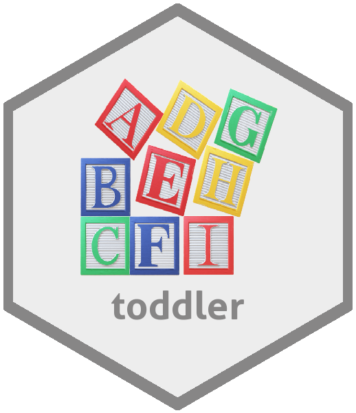

{width=200px}

```{r setup, include=FALSE}
library(toddler)
library(dplyr)
knitr::opts_chunk$set(echo = TRUE)
```

**toddler** provides simple functions to format data frames prior to sharing. Users can add empty rows, add empty columns, or stack data frames. 

## Installation

You can install this package from [GitHub](https://github.com/scottyd22/) with:

```{r eval=FALSE}
devtools::install_github('scottyd22/toddler')
```

## Using toddler

Below are some examples on how to use the **toddler** functions.

Add rows to a data frame using the `add_empty_rows` function.

```{r echo=TRUE, eval=TRUE}
library(dplyr)
library(toddler)

df <- mtcars[1:10,] %>% 
  arrange(gear, carb)

add_empty_rows(df, group = c('carb', 'gear'))
```

Add empty columns to a data frame using the `add_empty_cols` function.

```{r echo=TRUE, eval=TRUE}
df <- mtcars[1:5, 1:6]
add_empty_cols(df, group = 2, n = 2)
```

Stack data frames into a single "tall" data frame using the `df_stack` function.

```{r echo=TRUE, eval=TRUE}
df1 <- mtcars[1:5, 1:6]
df2 <- iris[1:8,]
df_stack(list(df1, df2), n = 2)
```
